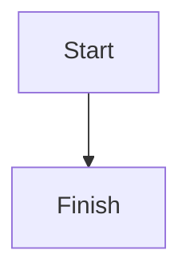

# MDX View

Create, edit, and preview `.mdx` files in Obsidian — Markdown with real, interactive components (charts, callouts, diagrams) rendered right alongside your notes.

## What it does

- **Edit `.mdx` files like any other note.** They open in Obsidian's normal editor, with the same Live Preview and Reading Mode you already use for Markdown.
- **See JSX actually render.** Reading Mode shows the raw code for components, so this plugin adds a separate **Preview** pane that compiles and renders them for real — safely, in an isolated sandbox with no access to your vault.
- **Use Obsidian's own syntax.** `[[wikilinks]]`, `![[embeds]]`, and regular Markdown images all work in `.mdx` files, including image embeds.
- **Bring your own components.** Point the plugin at a components file and reference custom components like `<MyChart data={...} />` directly in your notes — no import statement needed.

## Getting started

1. Install the plugin and enable it in Community Plugins.
2. Create or rename a file with the `.mdx` extension.
3. Click the eye icon in the ribbon (or run the **Open MDX preview** command) to open the preview pane alongside your editor.
4. The first time you open a preview, you'll be asked to confirm you trust the file — `.mdx` files can contain real JavaScript, so this is a one-time-per-session safety check, not a bug.

## Features

### Frontmatter

YAML frontmatter works as usual, and its values are available in the body:

```mdx
---
title: My Note
---

# {frontmatter.title}
```

### GitHub-flavored Markdown

Tables, strikethrough, and other GFM syntax render as expected.

### Syntax-highlighted code

Fenced code blocks are highlighted automatically — no setup required.

### Mermaid diagrams

````mdx

````

renders as an actual diagram, fully offline.

### Wikilinks and image embeds

- `![[photo.png]]` and standard `` both display the image inline.
- `[[Some Note]]` and `[[Some Note|custom label]]` render as clickable links that open the target note in Obsidian.
- Linking to a non-image file (`![[Some Note]]`) shows a clickable reference rather than the note's full content.

### Custom components

In **Settings → MDX View**, point **Components bundle** at a vault file that provides your components (e.g. `_components/bundle.js`), then use them directly in any `.mdx` file:

```mdx
<MyChart data={[1, 2, 3]} />
```

Two ways to create that bundle:

- **Bring a pre-built one.** Build it with any bundler (esbuild, webpack, etc.), keeping React external — the plugin already provides a shared React instance for it to use.
- **Build it in-app.** Set **Components source** to a `.tsx`/`.jsx` file in your vault with named exports (`export function MyChart() {...}`), then click **Rebuild**. The plugin compiles it for you, fully offline — no separate build tooling needed.

### Print / Save as PDF

Use the printer icon on an open preview to print it or save it as a PDF. Desktop only.

## Settings

| Setting | Description |
| --- | --- |
| Components bundle | Vault path to the JS file the preview reads for custom components. |
| Components source | Optional vault path to a `.tsx`/`.jsx` entry file to compile in-app via "Rebuild". |
| Preview debounce (ms) | How long to wait after you stop typing before refreshing the preview. |

## Known limitations

- Embedding a non-image note (`![[Some Note]]`) shows a link, not the note's rendered content — full transclusion isn't supported yet.
- `import`/`export` statements aren't supported inside `.mdx` files, since the preview sandbox has no network access. Use custom components (above) instead of importing them.
- Print/PDF is desktop only.
- Obsidian's native Reading Mode doesn't render JSX — use the plugin's Preview pane for that.

## Building from source

```bash
npm install
npm run build     # or `npm run dev` to watch
```

This produces `main.js`, `styles.css`, and `esbuild.wasm` alongside `manifest.json`. Copy all four into `<vault>/.obsidian/plugins/mdx-view/`, then reload Obsidian and enable the plugin.

## License

MIT — see [LICENSE](./LICENSE).
